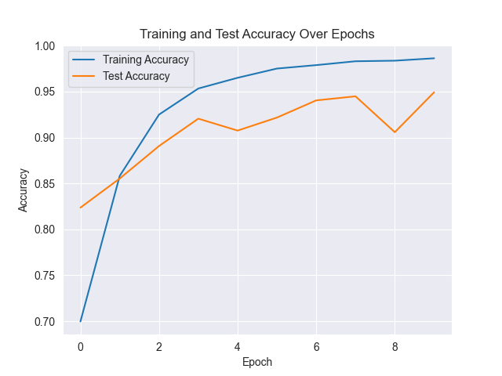

# Alzheimer Classification Using CNN (ResNet50)

This project focuses on image classification for Alzheimer’s disease detection using a Convolutional Neural Network (CNN) model based on ResNet50. After training the model, Explainable Artificial Intelligence (XAI) techniques, such as LIME and Grad-CAM, are applied to explain and interpret the model's predictions.

## Objectives

- Training the CNN Model (ResNet50): Constructing and training a high-performance model for image classification to distinguish between stages of Alzheimer’s disease.
- Interpretative Analysis with XAI: Using LIME and Grad-CAM techniques to visualize and understand the model’s regions of interest, facilitating better interpretation of the classification results.

## Architecture of ResNet50

## Requirements

- Libraries: TensorFlow, Keras, scikit-learn, OpenCV, Seaborn, Matplotlib, PIL, and other required dependencies.

## Results

The model was successfully trained to achieve good classification performance

### - Classification report : 

### - Training and Test Accuracy :

### - TConfusion Matrix Renet50 :

## File Structure

- DataSet/ : Directory containing the Alzheimer’s disease image dataset Augmented.
- DataSet/ : Directory containing Original Dataset.
- XAI/ : Directory XAI techniques.
- Alzheimer_Classification_Using_CNN_Renet50.ipynb : Source code for model training, evaluation.

## Contact : 

- Linkedin : https://www.linkedin.com/in/el-hassan-bensalih-01822924b/
