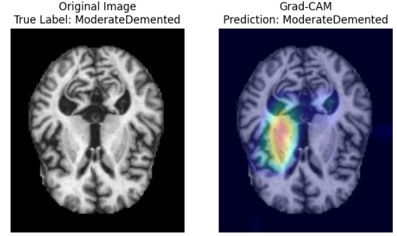

# Explainable AI for Alzheimer Classification CNN (Renet)

# Step 1 :
## Alzheimer Classification Using CNN (ResNet50)

This project focuses on image classification for Alzheimer’s disease detection using a Convolutional Neural Network (CNN) model based on ResNet50. After training the model, Explainable Artificial Intelligence (XAI) techniques, such as LIME and Grad-CAM, are applied to explain and interpret the model's predictions.

## Objectives

- Training the CNN Model (ResNet50): Constructing and training a high-performance model for image classification to distinguish between stages of Alzheimer’s disease.
- Interpretative Analysis with XAI: Using LIME and Grad-CAM techniques to visualize and understand the model’s regions of interest, facilitating better interpretation of the classification results.

## Architecture of ResNet50

## Requirements

- Libraries: TensorFlow, Keras, scikit-learn, OpenCV, Seaborn, Matplotlib, PIL, and other required dependencies.

## Results

The model was successfully trained to achieve good classification performance

### - Classification report : 

### - Training and Test Accuracy :

### - TConfusion Matrix Renet50 :

## File Structure

- DataSet/ : Directory containing the Alzheimer’s disease image dataset Augmented.
- DataSet/ : Directory containing Original Dataset.
- XAI/ : Directory XAI techniques.
- Alzheimer_Classification_Using_CNN_Renet50.ipynb : Source code for model training, evaluation.

# Step 2 : 
## Explainable AI for Image Classification

This project demonstrates an application of Explainable Artificial Intelligence (XAI) methods in the context of image classification. It explores how various interpretability techniques can provide insights into the decision-making processes of image classification models, aiming to make AI more transparent and accountable.

## Project Overview

The primary goals of this project are:

- To apply interpretability methods, such as Grad-CAM, LIME, or SHAP, to explain the model's predictions.
- To evaluate the effectiveness of these techniques in providing meaningful explanations for classification decisions.

## Results

The explanations generated by each technique provide insights into the areas of the image that the model considered important for classification. This can help in verifying model decisions, debugging, and enhancing transparency in AI systems.

### 1- Lime Results:

### 2- GradCam Results:

## Contact : 

- Linkedin : https://www.linkedin.com/in/el-hassan-bensalih-01822924b/
